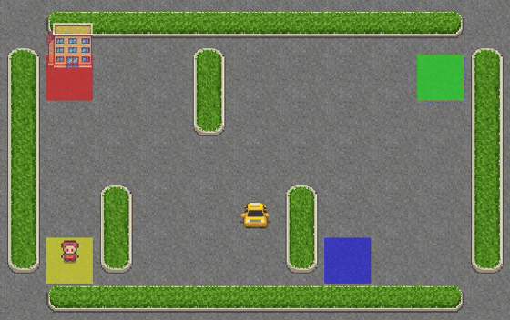

# **Q-learning Implementation** 

This repository contains a from-scratch implementation of **Q-learning**, a fundamental **reinforcement learning (RL)** algorithm. The implementation is tested in the **FrozenLake** and **Taxi Problem** environments provided by OpenAI's Gym.  

##  **Overview**  
Q-learning is a model-free RL algorithm that enables an agent to learn optimal policies through trial and error. The goal is to maximize cumulative rewards by updating Q-values using the Bellman equation.  

This project demonstrates Q-learning in two environments:  
 **FrozenLake (8×8, Slippery)** – A grid-world navigation problem.  
 **Custom Taxi Environment** – A modified version of the classic Taxi-v3 problem.  

---

## **Colab Notebooks**  
You can explore the implementations interactively on Google Colab:  

| Environment | Colab Link |
|------------|------------|
| **Q-learning Implementation** |  |
| **FrozenLake (8×8, Slippery)** |  |
| **Custom Taxi Environment** |  |

---

##  **Trained Models**  
The trained Q-learning models are available on **Hugging Face** for evaluation.  

| Model | Hugging Face Link | Preview |
|-------|------------------|---------|
| **FrozenLake (4×4, Non-Slippery)** | [🔗 Model](https://huggingface.co/yashrajkupekar/q-FrozenLake-v1-4x4-noSlippery) |  |
| **FrozenLake (8×8, Slippery)** | [🔗 Model](https://huggingface.co/yashrajkupekar/FrozenLake-v1-8x8-Slippery) |  |
| **Taxi (500 states)** | [🔗 Model](https://huggingface.co/yashrajkupekar/Taxi_500states) |  |
| **Taxi (7200 states)** | [🔗 Model](https://huggingface.co/yashrajkupekar/Taxi_7200states) |  |

---
##  **References**  
- [Q-learning Algorithm (Wikipedia)](https://en.wikipedia.org/wiki/Q-learning)  
- [OpenAI Gym Documentation](https://www.gymlibrary.dev/)  

---
